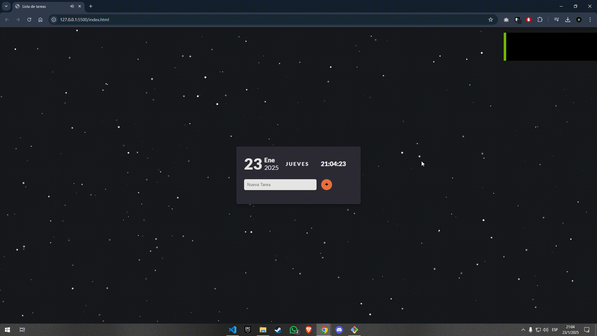

# Lista de tareas

Este proyecto es una aplicación web de lista de tareas simple pero efectiva construida utilizando HTML, CSS y JavaScript. Permite a los usuarios:

Crear nuevas tareas: Los usuarios pueden ingresar nuevas tareas y agregarlas a la lista.
Marcar tareas como completadas: Las tareas se pueden marcar como completadas, indicando visualmente su estado.
Eliminar tareas: Los usuarios pueden eliminar las tareas completadas o no deseadas de la lista. 

English

This project is a simple yet effective to-do list web application built using HTML, CSS, and JavaScript. It allows users to:

Create new tasks: Users can input new tasks and add them to the list.
Mark tasks as complete: Tasks can be marked as complete, visually indicating their status.
Delete tasks: Users can remove completed or unwanted tasks from the list.

## Screenshots

